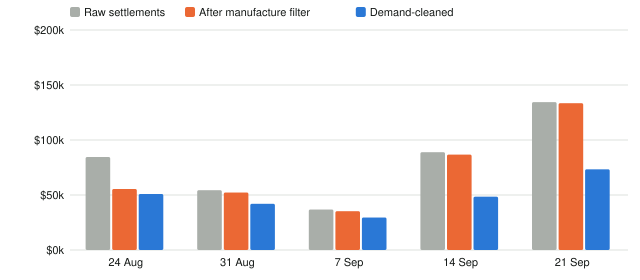
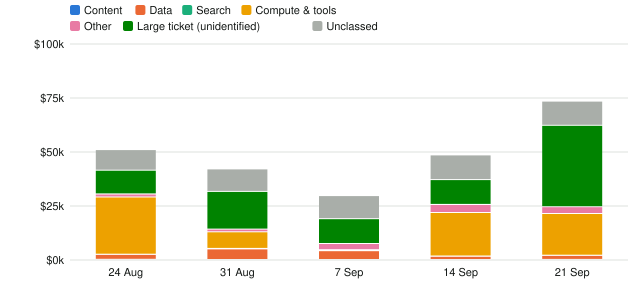
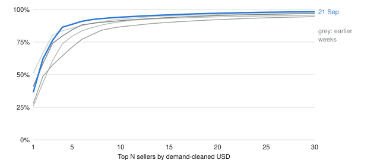
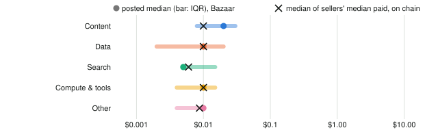

<!-- Draft by ClCo (ORDER_012 Build 5). Every number is generated from data/x402_index by compute_numbers.py at render
     time. The descriptive sections carry no argument. TODO(Wes) marks the introduction, interpretation and conclusion,
     which are yours. Don't post to SSRN before you've written them and re-read every number against the index page. -->

## Introduction {#sec-intro}

::: {.callout-note appearance="simple"}
**TODO(Wes): introduction.** Why measure what agents buy; what raw x402 dashboards claim and why that is not demand;
the question this paper answers; the contribution relative to @d05 and @d04 (a weekly, open, reproducible, *categorised*
demand series, not a one-off census); and a roadmap.
:::

## Background and related work {#sec-related}

x402 revives HTTP status 402 ("Payment Required"). A server answers an unpaid request with a price, a network, an asset
and a payee; the client signs a stablecoin transfer authorisation and retries; a *facilitator* verifies it and submits
the transfer on chain. On Base, nearly all x402 payments are USDC `transferWithAuthorization` calls sent by a small set
of facilitators. Sellers can list their resources, with prices, in discovery catalogues such as the Coinbase CDP
Bazaar.

Measurement work on x402 has so far been census-style. @d04 analyses 143.8 million x402 transactions from May to
December 2025, finding sub-dollar payments, a median endpoint price of $0.01 and extreme merchant concentration.
@d05 resolves payers through meta-transactions and classifies Base settlements on the payment graph; it finds 84.98% of
settlements operator-internal and at least 21.20% fictitious by count, and bounds genuine third-party value widely.
An industry settlement map [@s385] reaches a similar conclusion (about 7% genuine) with an undisclosed method.
@d09 surveys the wider "agent economy", and @s146 systematises blockchain agent-to-agent payments. On the buyer side,
@s384 studies which payable service a budget-limited agent should choose. On the publisher side, @s350 documents the
rapid spread of AI-crawler restrictions in robots.txt and terms of service, and @s354 surveys AI-crawler directives on
popular sites: permissions, not prices.

This paper differs in three ways: it is **weekly and continuing**, not a snapshot; every filter is a published, rerunnable
rule, with its code and intermediate state public; and it **classifies sellers by what they sell**, so the question
"how much do agents pay for content?" can be answered directly.

## Data and filters {#sec-data}

**Settlements.** For each Monday-to-Sunday UTC week, I collect every successful transaction sent by 128 known x402
facilitator addresses on Base, from the public Blockscout API, and keep USDC `transferWithAuthorization` calls (both
signature variants). The payer is the authoriser, the seller the recipient, the amount the USDC value. Across the
 weeks this gives  payer-resolved settlements worth
. Payments to or from my own test addresses are dropped first.

**Manufacture filter (after @d05).** Two rules, applied in order, each a lower bound on manufactured activity:

- *C1, fictitious:* the payer is the seller, or payer and seller sit in the same strongly connected component of the
  week's payment graph (a closed loop).  of settlements.
- *C2, internal:* payer and seller fall in one funding-linked cluster, built from the newest 50 non-settlement USDC
  transfers into (top-ups) and out of (sweeps) the busiest addresses until they cover 90% of settlement endpoints
  (capped at  lookups a week). Exchanges, bridges, contracts and tagged addresses never
  link anyone.  of settlements.

A **fan-out check** then covers the largest cleaned sellers whose buyers mostly pay once. It samples their buyers'
funders and flags a seller only when shared funders bankroll most sampled buyers *and* the money is circular or the
buyers buy nothing else. It flagged  seller in the period.

**Dust filter (after @s385).** A seller paid by exactly one distinct buyer in the week is dropped.

@tbl-weeks shows each stage, and @fig-stages plots it.



: Weekly settlements by filter stage. Sellers, buyers and payments are after all filters; top-10 share is the share
of cleaned USD taken by the ten largest sellers. {#tbl-weeks}

{#fig-stages}

The manufacture filter removed less than 10% of raw value in  weeks (at most
); the dust filter removed  of what remained in the latest
week. In that week,
 addresses received a settlement, but only  were paid
by two or more genuine buyers. Cleaned value per week ranged from  to
.

## What sellers sell {#sec-categories}

Every seller gets one category from the text of its listings (resource URL, name, tags, description) in every Bazaar
snapshot I hold, plus an earlier x402scan pull. A small language model (Mistral Small 3.2, with Gemini 2.5 Flash Lite
as a fallback) assigns *content*, *data*, *search*, *compute* or *other*; hand labels override it. Against
 earlier hand labels, the published labels agree on content / data / neither for
 of sellers. In a blind hand check of  new sellers, they agreed on
all five categories for  and on content / data / neither for
. A full hand audit of the  sellers labelled content found
 that were not, and relabelled them. Sellers with no listing stay *unclassed*, except
the largest ones whose median payment exceeds the 99th percentile of posted per-call prices. Those are labelled *large
ticket (unidentified)*: a label from price alone, not an identification.



: Demand-cleaned spend by category, week of . Compute includes tools; large ticket is
unidentified. Posted: median exact-scheme Base USDC price per call in the Bazaar snapshot of
. Paid: median over sellers of each seller's median cleaned payment. {#tbl-cats}

{#fig-categories}

**Content, data and compute.** In the week of , content sellers received
 ( of cleaned value) from
 payments to  sellers. Data sellers received
 from  payments, and compute and tools
. Over the whole period, content totals , data
 and compute . Cleaned content plus data went from
 in the first week to  in the last ().

::: {.callout-note appearance="simple"}
**TODO(Wes): interpretation.** What the category split says about what agents are used for today, and why content is
nearly absent, given that it is widely listed ( content resources in the latest snapshot).
:::

## Concentration {#sec-concentration}

Cleaned value is highly concentrated (@fig-concentration). In the week of , the largest seller
took  of cleaned USD: a  seller paid
 times by  buyers, with a median payment of
. Half of cleaned value went to  sellers and 80% to
. The ten largest took between  and  of
cleaned value in every week. The Herfindahl–Hirschman index in the latest week was  (on the
0–10,000 scale). At the other end,  of cleaned sellers had fewer than five distinct
buyers;  had a hundred or more.

{#fig-concentration}

## Prices {#sec-prices}

Across  priced resources in the Bazaar snapshot of , the median
posted price per call is  (interquartile range  to
). On chain,  of cleaned sellers had a median
payment below one cent, and  a median of a dollar or more (@fig-prices). Posted
content is priced at a median  a call, similar to data () and
above search (). A chain-linked Jevons index of paid prices, over sellers present in
consecutive weeks, stood at  in the last week (first week = 100).

{#fig-prices}

## Limitations {#sec-limits}

- **Lower-bound filters.** C1 and C2 remove only what they can prove, from the newest 50 transfers of a capped set of
  addresses; cleaned figures are therefore an *upper* bound on genuine demand. Two wallets of one operator funded from
  an exchange stay separate.
- **Categories are approximate.** They come from listing text, which sellers write; thin listings are often
  misclassified. Content is so small that one misclassified seller moves it.
- **Unlisted value is unidentified.** A large share of cleaned value goes to sellers with no listing. Some are likely
  business-to-business or app payments, not agent purchases.
- **Base only.** x402 on Solana and other chains, and off-chain credit schemes, are not counted. Permit2 and batch-proxy
  settlements (about $23 in the week of 21 September) are excluded.
- **Short window.**  weeks. Growth rates over this window are noisy, and one seller can swing a
  category week to week.

## Replication {#sec-replication}

Everything is public under MIT (code) and CC BY 4.0 (data and text) at
<https://github.com/doescodinggiteasier/wknipe-site>. The committed state (`state/`: compact listing snapshots,
per-week filter results and the funding-link cache) rebuilds every published number without network access:

```bash
X402_STATE=state python3 scripts/x402_index/run.py   # rebuilds data/x402_index exactly
cd paper && quarto render                           # this paper, numbers and figures regenerated
```

Collecting a new week needs only public Blockscout (about three hours inside its rate limits). The index is updated
every Monday at <https://wknipe.com/x402/>, and each release of the repository is archived on Zenodo with a DOI.

## Conclusion {#sec-conclusion}

::: {.callout-note appearance="simple"}
**TODO(Wes): conclusion.** What the reader should take away, what would change the picture (the tripwire), and what
comes next.
:::

## References {.unnumbered}

::: {#refs}
:::
